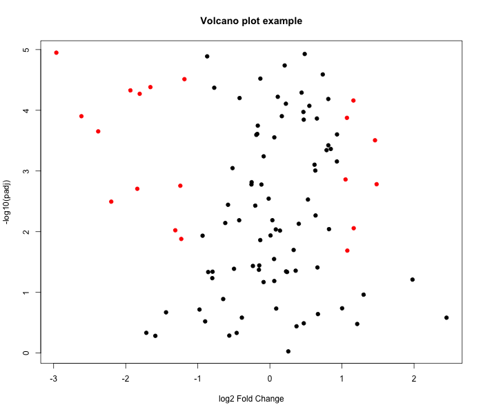
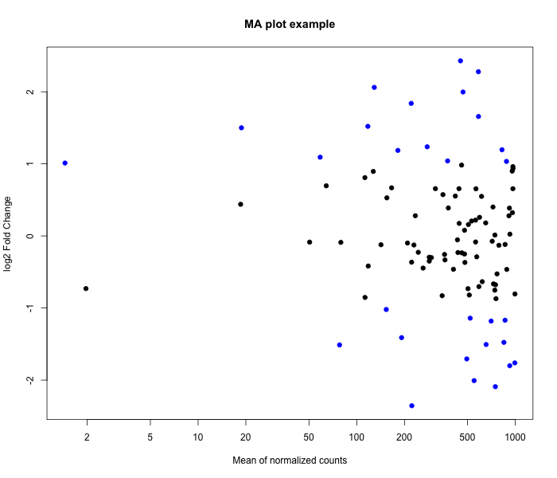
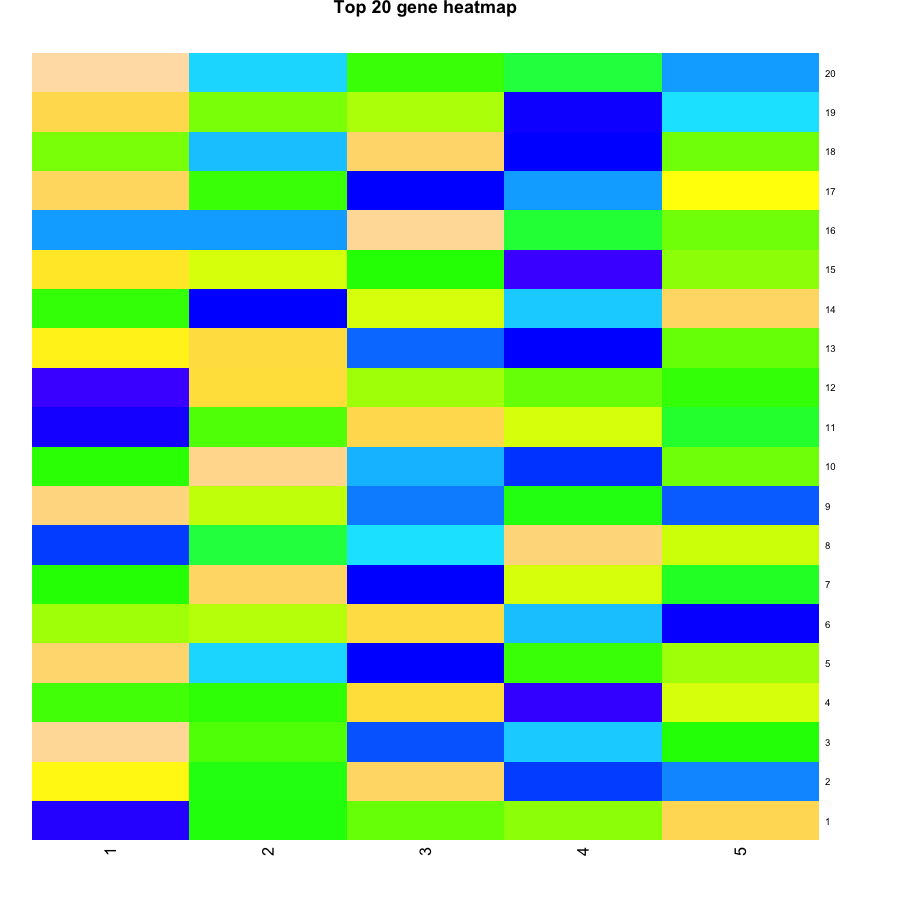

# E. coli RNA-seq Pipeline

A reproducible RNA-seq analysis pipeline for *Escherichia coli*. This repository includes alignment, gene counting, differential expression, QC summaries, and plotting.

## Features

- Paired-end Bowtie2 alignment and Samtools sorting.
- `featureCounts` gene-level read quantification.
- DESeq2 differential expression analysis.
- FastQC and MultiQC raw-read QC summaries.
- R plotting scripts for volcano, MA, heatmap, and exploratory expression plots.
- Example dataset and sample metadata for quick validation.

## Repository structure

- `config/`: pipeline configuration templates.
- `scripts/`: active pipeline wrapper and analysis scripts.
- `example_data/`: test counts, metadata, and sample dataset.
- `results/`: generated example plots, QC summaries, and results.
- `.github/workflows/`: GitHub Actions automation.
- `docs/`: pipeline usage and details.

> The active workflow is implemented in `scripts/`; `rnaseq/` is an archival copy and not required for the example execution.

## Dataset

The example dataset contains RNA-seq counts for three *E. coli* samples across two conditions:

- `sample_A`: control
- `sample_B`: treated
- `sample_C`: treated

The dataset is intended to demonstrate the DESeq2 workflow and generate example plots without requiring raw sequencing data.

## Requirements

- `conda` or `mamba`
- Linux/macOS
- `environment.yml` defines required tools and R packages

## Bioconductor packages

Some Bioconductor packages (for example `DESeq2` and `apeglm`) are not always available as conda packages for every platform. Install them in R using `BiocManager` after activating the conda environment:

```r
if (!requireNamespace("BiocManager", quietly = TRUE))
   install.packages("BiocManager", repos = "https://cloud.r-project.org")
BiocManager::install(c("DESeq2", "apeglm"), update = FALSE, ask = FALSE)
```

## Setup

1. Create the conda environment:
   ```bash
   conda env create -f environment.yml
   conda activate ecoli-rnaseq
   ```
2. Update `config/pipeline.env` if you want to use a local `WORKDIR`.
3. Run the sample differential expression workflow:
   ```bash
   Rscript scripts/differential_gene_expression.R \
     --counts example_data/test_counts.csv \
     --metadata example_data/sample_metadata.tsv \
     --outdir results/diff_exp

   Rscript scripts/generate_plots.R \
     --results results/diff_exp/differential_expression_results.csv \
     --vst results/diff_exp/vst_normalized_counts.csv \
     --outdir results/plots
   ```
4. To execute the full alignment pipeline, provide FASTQ and reference files, then run:
   ```bash
   bash scripts/pipeline.sh
   ```

## Example outputs

### Differential expression results

- `results/diff_exp/differential_expression_results.csv`
- `results/diff_exp/vst_normalized_counts.csv`
- `results/diff_exp/dds_object.rds`

### Plots

These example figures illustrate the expected analysis outputs.







Note: the example figures `results/plots/ma_plot.png`, `results/plots/volcano_plot.png`, and `results/plots/top20_heatmap.png` were regenerated in this update.

### Example results summary

- `gene_004` is significantly downregulated in treated versus control.
- Volcano plot highlights genes with `|log2FC| > 1` and `padj < 0.05`.
- MA plot shows fold-change relative to mean normalized expression.

### QC summaries

- `results/qc/raw_fastq/fastqc_summary.txt`
- `results/qc/alignment/sample_A.flagstat.txt`

## Notes

- `scripts/pipeline.sh` invokes `scripts/ecoli_rnaseq_gcp_pipeline.sh`.
- `config/pipeline.env` contains configurable paths and reference names.
- `example_data/test_counts.csv` and `example_data/sample_metadata.tsv` can be used to validate the DESeq2 pipeline without full raw sequencing data.

## Documentation

More details are available in `docs/README.md`.
